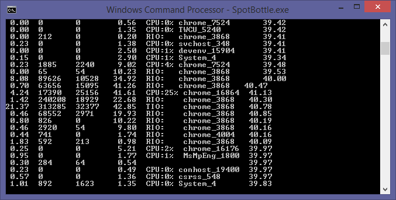

# ResourceMonitor
Command line resource monitor. Displays CPU, network, disk, RAM, and process bottleneck information.

The purpose of this program is to get an idea of where a system performance bottleneck is coming from, whether that be hard drive related, bandwidth related, or something else. The program attempts to give the name of the process which is most likely to be causing a bottleneck. 

I have this running all of the time in the corner of my screen so I can always see network and disk activity. I propose shrinking the command prompt text size from 8x12 to 6x8 if you do the same, in the Font tab of the Properties window. 

Each line of stats is updated with stats per second. Displays in this order:

* % Disk Read/Write Time
* Bytes Downloaded
* Bytes Uploaded
* % Processor Usage Time
* Process Name
* % Physical RAM Used

Notes:

* % Disk Read/Write Time is given for the physical disk most in use. The program calculates this percent for all physical disks and then displays the highest value to give the user a sense of where a potential system performance bottleneck is coming from. Because hard drives are often the cause of a computer feeling slow, this number is displayed first. 
* Bytes Downloaded/Uploaded are sums of bytes across all network interfaces.
* % Processor Usage Time is the average across all processors.
* The process name is determined as such:

1. If CPU usage is over 90%, display the process with the highest individual CPU usage.
2. If physical disk usage is over 50%, display the process with the highest individual total I/O bytes. The total I/O bytes includes both disk and network I/O for that process because that's what Microsoft's performance counter library offers. It works well enough.
3. If network bytes downloaded > network bytes uploaded, display the process with the highest individual I/O read bytes. 
4. If network bytes uploaded < network bytes downloaded, display the process with the highest individual I/O write bytes. 
